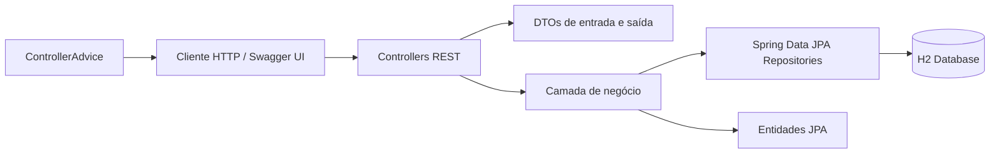
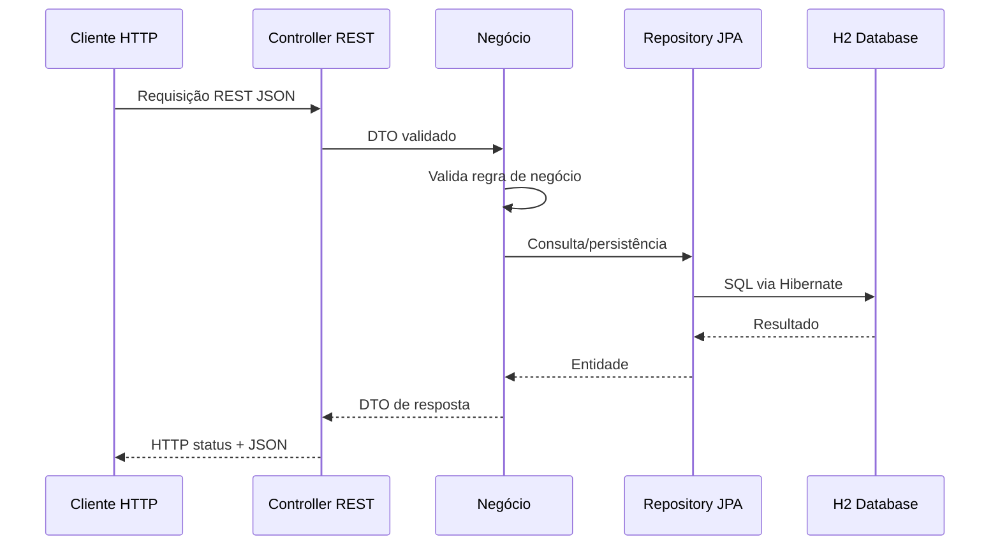
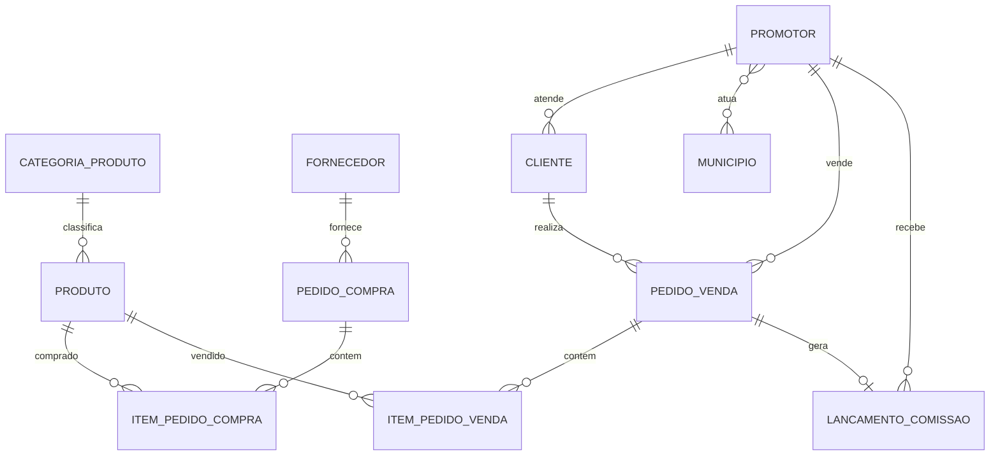
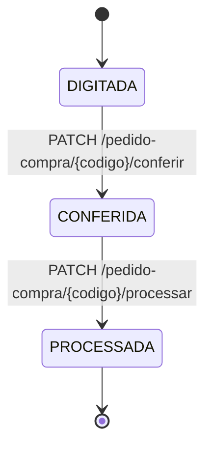
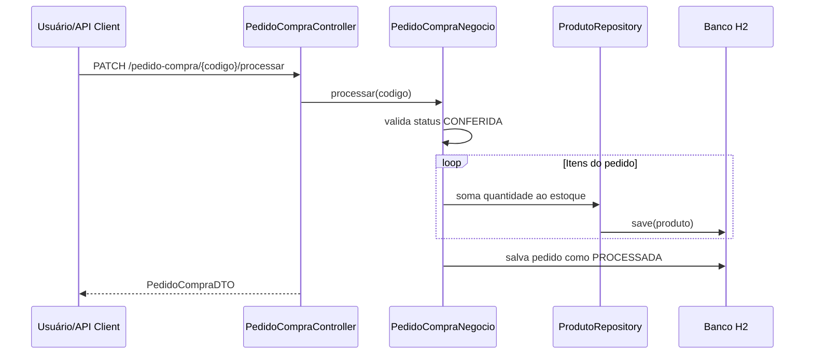
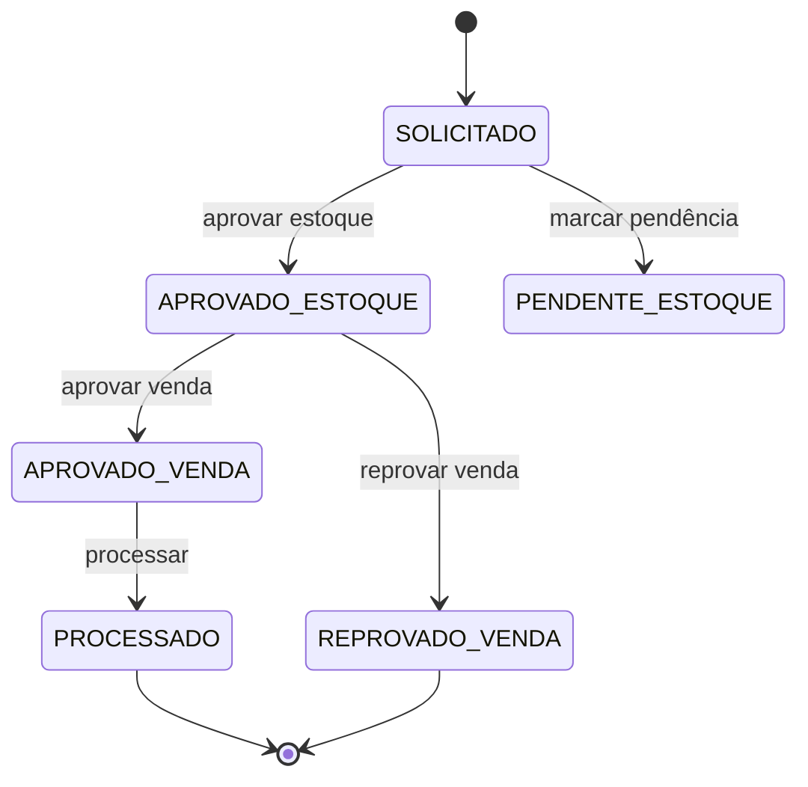
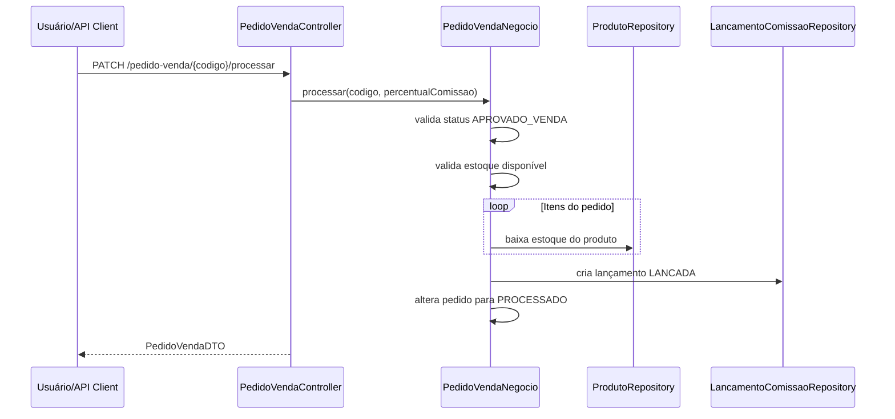
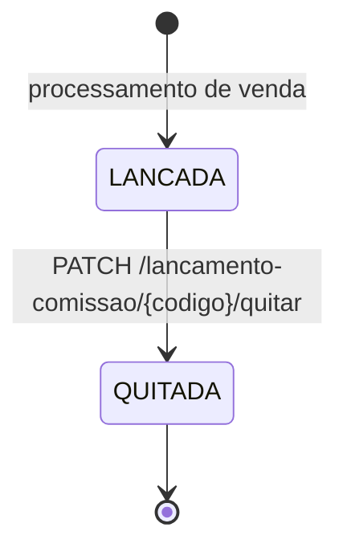

# SGCVP API

API REST para gerenciamento comercial, vendas, compras, estoque, clientes, promotores e comissões da aplicação SGCVP.

## Descrição Geral

O SGCVP API centraliza operações essenciais de um fluxo comercial: cadastro de clientes, promotores, categorias e produtos; registro de pedidos de compra; registro e aprovação de pedidos de venda; movimentação de estoque; e geração/consulta/quitação de comissões de promotores.

O problema de negócio resolvido é a necessidade de controlar, em uma única API, o ciclo operacional entre compra de produtos, disponibilidade de estoque, venda para clientes, atuação de promotores e pagamento de comissões. A solução reduz controles manuais, padroniza regras de negócio e expõe contratos REST documentados por OpenAPI/Swagger para integração com clientes externos ou interfaces web.

Objetivos principais:

| Objetivo | Descrição |
| --- | --- |
| Gestão cadastral | Manter clientes, promotores, produtos e categorias de produto. |
| Controle de estoque | Registrar entradas via pedidos de compra e saídas via processamento de vendas. |
| Fluxo de vendas | Controlar estados de pedidos de venda desde solicitação até processamento. |
| Comissionamento | Gerar lançamentos de comissão ao processar pedidos de venda e permitir quitação. |
| Contrato de API | Disponibilizar documentação OpenAPI gerada a partir do código. |

## Arquitetura da Solução

A aplicação utiliza uma arquitetura em camadas típica de APIs Spring Boot, com separação entre exposição HTTP, regras de negócio, persistência e modelo de domínio.



### Padrões Arquiteturais Utilizados

| Padrão | Aplicação no projeto |
| --- | --- |
| Layered Architecture | `controller`, `negocio`, `repository`, `entity` e `dto` separam responsabilidades. |
| DTO | Os payloads da API são representados por DTOs, evitando exposição direta das entidades. |
| Repository | Interfaces Spring Data JPA encapsulam consultas e persistência. |
| Service Layer | Classes `*Negocio` concentram validações e regras transacionais. |
| Exception Handler | `CustomEntityResponseHandler` padroniza respostas de erro. |
| Code-First OpenAPI | Swagger/OpenAPI é gerado a partir de anotações e configuração Java. |
| HATEOAS parcial | Alguns endpoints retornam `EntityModel` e `CollectionModel` com links. |

### Justificativas

| Decisão | Justificativa |
| --- | --- |
| Spring Boot 3.5.0 | Reduz configuração manual e fornece base moderna para APIs REST. |
| Java 17 | Versão LTS compatível com Spring Boot 3.x. |
| H2 em memória | Facilita execução local e desenvolvimento inicial sem infraestrutura externa. |
| Spring Data JPA | Simplifica persistência e consultas derivadas por método. |
| OpenAPI via springdoc | Gera contrato navegável em Swagger UI e JSON em `/v3/api-docs`. |
| DTOs com Bean Validation | Centraliza validação de entrada próxima ao contrato da API. |

### Fluxo de Comunicação



## Estrutura do Projeto

```text
sgcvp-api/
├── pom.xml
├── mvnw / mvnw.cmd
├── src/
│   ├── main/
│   │   ├── java/ifmt/cba/sgcvp/
│   │   │   ├── config/
│   │   │   ├── controller/
│   │   │   ├── dto/
│   │   │   ├── entity/
│   │   │   ├── exception/
│   │   │   ├── negocio/
│   │   │   ├── repository/
│   │   │   ├── GeradorBaseDados.java
│   │   │   └── SGCVPApllication.java
│   │   └── resources/
│   │       └── application.yml
│   └── test/
│       └── java/
└── log/
```

| Diretório | Responsabilidade |
| --- | --- |
| `config` | Configurações da aplicação, incluindo `SwaggerConfig`. |
| `controller` | Endpoints REST, documentação OpenAPI e montagem de respostas HTTP. |
| `dto` | Contratos de entrada e saída da API, com validação e schemas Swagger. |
| `entity` | Entidades JPA e validações de domínio simples. |
| `exception` | Exceções customizadas e handler global de erros. |
| `negocio` | Regras de negócio, transições de estado e orquestração transacional. |
| `repository` | Persistência via Spring Data JPA. |
| `resources` | Configuração YAML da aplicação. |
| `log` | Arquivos de log gerados localmente. |

Também existe um pacote `ifmt.cba.exemplo`, aparentemente legado ou de referência. A aplicação principal é `ifmt.cba.sgcvp.SGCVPApllication`.

Convenções adotadas:

| Convenção | Exemplo |
| --- | --- |
| Controllers no singular | `/cliente`, `/produto`, `/pedido-venda` |
| Serviços com sufixo `Negocio` | `ClienteNegocio`, `PedidoVendaNegocio` |
| DTOs com sufixo `DTO` | `ClienteDTO`, `PedidoVendaDTO` |
| Repositórios com sufixo `Repository` | `ProdutoRepository` |
| Exceções customizadas por cenário | `NotFoundException`, `NotValidDataException` |

## Tecnologias Utilizadas

| Categoria | Tecnologia | Uso |
| --- | --- | --- |
| Linguagem | Java 17 | Desenvolvimento da aplicação. |
| Framework | Spring Boot 3.5.0 | Base da API. |
| Web | Spring MVC | Controllers REST. |
| Persistência | Spring Data JPA / Hibernate | ORM e repositórios. |
| Validação | Spring Validation / Jakarta Validation | Validação de DTOs. |
| HATEOAS | Spring HATEOAS | Links em parte das respostas. |
| Documentação | springdoc-openapi 2.8.9 | Swagger UI e OpenAPI JSON. |
| Banco | H2 2.3.232 | Banco em memória para desenvolvimento. |
| Mapeamento | ModelMapper 3.2.3 | Conversão entre entidades e DTOs. |
| Utilitários | Apache Commons Lang 3.17.0 | `ToStringBuilder` e utilidades. |
| Boilerplate | Lombok | Getters, setters, construtores e igualdade. |
| Build | Maven Wrapper | Build e execução padronizados. |
| Testes | spring-boot-starter-test | Base para testes automatizados. |
| Logs | SLF4J + Logback | Registro em console e arquivo. |

## Requisitos

### Requisitos Funcionais

| Código | Funcionalidade | Situação |
| --- | --- | --- |
| RF01 | Cadastrar, alterar, listar, consultar e excluir categorias de produto. | Implementado |
| RF02 | Listar categorias ordenadas por nome. | Implementado |
| RF03 | Cadastrar, alterar, listar, consultar e excluir produtos. | Implementado |
| RF04 | Consultar produtos por categoria ordenados por nome ou estoque decrescente. | Implementado |
| RF05 | Consultar produtos abaixo do estoque mínimo. | Implementado |
| RF06 | Cadastrar, alterar, listar, consultar e excluir clientes. | Implementado |
| RF07 | Consultar cliente por código, razão social ou CNPJ. | Implementado |
| RF08 | Consultar clientes de promotor por valor vendido em período. | Implementado |
| RF09 | Cadastrar, alterar, listar, consultar e excluir promotores. | Implementado |
| RF10 | Consultar municípios atendidos por promotor. | Implementado |
| RF11 | Cadastrar, alterar, listar, consultar e excluir pedidos de compra. | Implementado |
| RF12 | Conferir e processar pedidos de compra, atualizando estoque. | Implementado |
| RF13 | Cadastrar, alterar, listar, consultar e excluir pedidos de venda. | Implementado |
| RF14 | Aprovar estoque, marcar pendência, aprovar/reprovar venda e processar pedidos de venda. | Implementado |
| RF15 | Baixar estoque e gerar comissão no processamento de venda. | Implementado |
| RF16 | Consultar lançamentos de comissão por código, status, período e promotor. | Implementado |
| RF17 | Quitar lançamentos de comissão. | Implementado |
| RF18 | Expor documentação Swagger UI e OpenAPI JSON. | Implementado |

### Requisitos Não Funcionais

| Categoria | Estado atual | Observações |
| --- | --- | --- |
| Segurança | Básica, sem autenticação/autorização implementada | Não há Spring Security configurado. |
| Performance | Adequada para uso local e cargas pequenas | Uso de H2 em memória e relacionamentos `EAGER` em várias entidades. |
| Escalabilidade | Monolito modular em camadas | Evolução para banco externo e paginação é recomendada. |
| Manutenibilidade | Boa separação por pacotes | Regras de negócio concentradas em `negocio`. |
| Observabilidade | Logs em arquivo e console | Sem métricas, tracing ou health checks customizados. |
| Documentação | Swagger/OpenAPI e README | Contratos disponíveis em Swagger UI. |
| Resiliência | Tratamento global de exceções | Sem retries, circuit breakers ou filas. |

## Modelo de Domínio

### Entidades Principais

| Entidade | Responsabilidade |
| --- | --- |
| `CategoriaProduto` | Classificação de produtos. |
| `Produto` | Item comercializado, com preço, estoque atual e estoque mínimo. |
| `Fornecedor` | Origem de produtos em pedidos de compra. |
| `PedidoCompra` | Pedido de entrada de produtos no estoque. |
| `ItemPedidoCompra` | Produto e quantidade em um pedido de compra. |
| `Cliente` | Pessoa jurídica compradora, vinculada a um promotor. |
| `Promotor` | Responsável comercial por clientes e municípios. |
| `Municipio` | Localidade atendida por promotores. |
| `PedidoVenda` | Pedido comercial de venda para cliente. |
| `ItemPedidoVenda` | Produto, quantidade e valor unitário de uma venda. |
| `LancamentoComissao` | Comissão gerada a partir de venda processada. |

### Relacionamentos



### Regras de Negócio

| Regra | Descrição |
| --- | --- |
| Categoria única por nome | Inclusão impede categoria já existente por nome. |
| Categoria com produtos não pode ser excluída | Exclusão é bloqueada quando há produtos relacionados. |
| Produto único por nome | Inclusão impede produto já existente por nome. |
| Produto exige categoria existente | Inclusão/alteração valida categoria. |
| Cliente único por CNPJ | Inclusão impede CNPJ duplicado. |
| Cliente exige promotor existente | Inclusão/alteração valida promotor. |
| Promotor único por nome | Inclusão impede promotor já existente por nome. |
| Promotor com clientes não pode ser excluído | Exclusão é bloqueada quando há clientes vinculados. |
| Pedido de compra exige fornecedor e produtos existentes | Relacionamentos são resolvidos antes da persistência. |
| Pedido de compra possui transição controlada | `DIGITADA -> CONFERIDA -> PROCESSADA`. |
| Pedido de compra processado soma estoque | Cada item incrementa o estoque do produto. |
| Pedido de venda possui transição controlada | Fluxos válidos definidos na camada de negócio. |
| Venda exige estoque suficiente | Aprovação de estoque e processamento validam disponibilidade. |
| Movimentação de estoque exige quantidade inteira | Quantidades fracionárias falham ao movimentar estoque. |
| Venda processada baixa estoque | O processamento decrementa estoque dos produtos vendidos. |
| Venda processada gera comissão única | Não permite comissão duplicada para o mesmo pedido. |
| Comissão pode ser quitada | Apenas comissão com status `LANCADA` pode virar `QUITADA`. |

## Fluxos de Negócio

### Pedido de Compra



Processamento de compra:



### Pedido de Venda



Processamento de venda:



### Comissão



## Integrações

### APIs Internas

A API expõe endpoints REST JSON agrupados por recurso.

| Recurso | Endpoints principais |
| --- | --- |
| Categorias | `GET/POST/PUT /categoria-produto`, `GET /categoria-produto/ordenadas-nome`, `GET /categoria-produto/codigo/{codigo}`, `GET /categoria-produto/nome/{nome}`, `DELETE /categoria-produto/{codigo}` |
| Produtos | `GET/POST/PUT /produto`, `GET /produto/codigo/{codigo}`, `GET /produto/nome/{nome}`, `GET /produto/categoria/{codigoCategoria}/ordenados-nome`, `GET /produto/categoria/{codigoCategoria}/estoque-decrescente`, `GET /produto/estoque-abaixo-minimo`, `DELETE /produto/{codigo}` |
| Clientes | `GET/POST/PUT /cliente`, `GET /cliente/codigo/{codigo}`, `GET /cliente/razao-social/{razaoSocial}`, `GET /cliente/cnpj/{CNPJ}`, `GET /cliente/promotor/{codigoPromotor}/valor-vendido`, `DELETE /cliente/{codigo}` |
| Promotores | `GET/POST/PUT /promotor`, `GET /promotor/codigo/{codigo}`, `GET /promotor/nome/{nome}`, `GET /promotor/{codigo}/municipios`, `DELETE /promotor/{codigo}` |
| Pedido de compra | `GET/POST/PUT /pedido-compra`, `GET /pedido-compra/codigo/{codigo}`, `GET /pedido-compra/nota-fiscal/{numNotaFiscal}`, `PATCH /pedido-compra/{codigo}/conferir`, `PATCH /pedido-compra/{codigo}/processar`, `DELETE /pedido-compra/{codigo}` |
| Pedido de venda | `GET/POST/PUT /pedido-venda`, `GET /pedido-venda/codigo/{codigo}`, `GET /pedido-venda/status/{status}`, `PATCH /pedido-venda/{codigo}/aprovar-estoque`, `PATCH /pedido-venda/{codigo}/pendente-estoque`, `PATCH /pedido-venda/{codigo}/aprovar-venda`, `PATCH /pedido-venda/{codigo}/reprovar-venda`, `PATCH /pedido-venda/{codigo}/processar`, `DELETE /pedido-venda/{codigo}` |
| Comissões | `GET /lancamento-comissao`, `GET /lancamento-comissao/codigo/{codigo}`, `GET /lancamento-comissao/status/{status}`, `GET /lancamento-comissao/lancadas/promotor/{codigoPromotor}`, `GET /lancamento-comissao/quitadas/promotor/{codigoPromotor}`, `PATCH /lancamento-comissao/{codigo}/quitar` |

### Documentação OpenAPI

| Recurso | URL |
| --- | --- |
| Swagger UI | `http://localhost:8080/swagger-ui.html` |
| Swagger UI alternativo | `http://localhost:8080/swagger-ui/index.html` |
| OpenAPI JSON | `http://localhost:8080/v3/api-docs` |
| H2 Console | `http://localhost:8080/h2-console` |

### Serviços Externos

Não há integrações externas implementadas no estado atual. O sistema utiliza apenas dependências locais da aplicação e banco H2 em memória.

Protocolos utilizados:

| Protocolo/Formato | Uso |
| --- | --- |
| HTTP/REST | Comunicação com clientes da API. |
| JSON | Corpo das requisições e respostas. |
| JDBC | Comunicação da aplicação com o banco via Hibernate/JPA. |

## Banco de Dados

### Estrutura Lógica

O banco configurado é H2 em memória:

```yaml
spring:
  datasource:
    driver-class-name: org.h2.Driver
    url: jdbc:h2:mem:sgcvpDB
    username: sa
    password:
```

O Hibernate está configurado com `ddl-auto: update`, criando/atualizando o schema automaticamente conforme as entidades JPA.

### Principais Tabelas

| Entidade | Campos relevantes |
| --- | --- |
| `CategoriaProduto` | `codigo`, `nome`, `descricao` |
| `Produto` | `codigo`, `nome`, `descricao`, `precoVenda`, `quantidadeEstoque`, `estoqueMinimo`, `categoriaProduto` |
| `Fornecedor` | `codigo`, `razaoSocial`, `CNPJ`, `endereco` |
| `PedidoCompra` | `codigo`, `dataEntrada`, `numNotaFiscal`, `status`, `fornecedor`, `listaItemPedidoCompra` |
| `ItemPedidoCompra` | `codigo`, `quantidade`, `produto`, `pedidoCompra` |
| `Cliente` | `codigo`, `razaoSocial`, `nomeFantasia`, `CNPJ`, `inscricaoEstadual`, `endereco`, `UF`, `promotor` |
| `Promotor` | `codigo`, `nome`, `listaMunicipio`, `listaCliente` |
| `Municipio` | `codigo`, `nome`, `UF` |
| `PedidoVenda` | `codigo`, `dataPedido`, `status`, `cliente`, `promotor`, `listaItemPedidoVenda` |
| `ItemPedidoVenda` | `codigo`, `quantidade`, `valorUnitario`, `produto`, `pedidoVenda` |
| `LancamentoComissao` | `codigo`, `dataLancamento`, `valor`, `status`, `promotor`, `pedidoVenda` |

### Versionamento de Banco

Estado atual:

| Item | Situação |
| --- | --- |
| Migrações versionadas | Não implementadas. |
| Estratégia atual | `spring.jpa.hibernate.ddl-auto=update`. |
| Recomendação | Introduzir Flyway ou Liquibase antes de ambientes homologação/produção. |

## Padrões de Desenvolvimento

### SOLID

| Princípio | Aplicação atual |
| --- | --- |
| SRP | Controllers expõem HTTP; serviços aplicam regras; repositories persistem. |
| OCP | Novas consultas podem ser adicionadas em repositories/serviços sem alterar controllers existentes. |
| LSP | Uso de interfaces Spring Data permite substituição por implementações compatíveis. |
| ISP | Repositories e serviços mantêm contratos específicos por agregado. |
| DIP | Controllers dependem da camada de negócio; serviços dependem de abstrações de repository. |

### Padrões GoF

| Padrão | Uso |
| --- | --- |
| Repository | Persistência encapsulada por interfaces Spring Data. |
| DTO | Transferência de dados entre API e domínio. |
| Mapper | `ModelMapper` realiza conversão entre entidades e DTOs. |
| Singleton gerenciado | Beans Spring como services, controllers e repositories. |

### Padrões GRASP

| Padrão | Aplicação |
| --- | --- |
| Controller | Classes `*Controller` recebem eventos HTTP. |
| Information Expert | Entidades possuem método `validar()` para validações próprias. |
| Low Coupling | Camadas reduzem acoplamento entre HTTP, negócio e persistência. |
| High Cohesion | Serviços são organizados por área de negócio. |

### Convenções de Código

| Convenção | Diretriz |
| --- | --- |
| Pacotes | Usar `ifmt.cba.sgcvp` para código da aplicação principal. |
| Rotas | Manter rotas existentes para preservar compatibilidade. |
| Respostas | Retornar DTOs ou modelos HATEOAS conforme padrão existente. |
| Validação | Preferir Jakarta Validation em DTOs e validação de regra em `negocio`. |
| Erros | Usar exceções customizadas e `CustomEntityResponseHandler`. |
| Documentação | Atualizar anotações Swagger ao criar/alterar endpoints e DTOs. |

## Segurança

Estado atual: não há autenticação nem autorização implementadas com Spring Security.

| Aspecto | Estado atual | Recomendação |
| --- | --- | --- |
| Autenticação | Não implementada | Adotar JWT/OAuth2 quando houver usuários reais. |
| Autorização | Não implementada | Definir perfis por módulo/operação. |
| Dados sensíveis | CNPJ trafega em JSON e é persistido em texto | Avaliar mascaramento em logs e políticas LGPD. |
| Swagger | Público no ambiente local | Restringir ou proteger em produção. |
| H2 Console | Habilitado | Desabilitar fora do desenvolvimento. |
| Logs | Arquivo `log/sgcvp.log` | Evitar dados pessoais/sensíveis em mensagens. |

Boas práticas já presentes:

| Prática | Descrição |
| --- | --- |
| Validação de entrada | DTOs usam Bean Validation. |
| Tratamento centralizado de erros | `ControllerAdvice` evita stack traces diretos no contrato HTTP. |
| Separação de DTOs e entidades | Reduz exposição acidental do modelo de persistência. |

## Estratégia de Testes

Estado atual: existe estrutura de testes com `spring-boot-starter-test`, mas a cobertura funcional ainda é limitada.

| Tipo | Estado atual | Estratégia recomendada |
| --- | --- | --- |
| Unitários | Não há suíte abrangente documentada | Testar classes `*Negocio`, especialmente transições de estado e validações. |
| Integração | Estrutura Spring Boot disponível | Testar controllers com MockMvc e banco H2. |
| End-to-end | Não implementado | Automatizar fluxos de compra, venda e comissão via coleção HTTP. |
| Contrato | Swagger disponível | Validar `/v3/api-docs` em pipeline. |

Cobertura esperada recomendada:

| Camada | Cobertura alvo |
| --- | --- |
| Regras críticas de negócio | 80% ou superior |
| Controllers principais | 70% ou superior |
| Repositories customizados | Testes de integração para consultas críticas |

## Instalação e Execução

### Pré-requisitos

| Ferramenta | Versão recomendada |
| --- | --- |
| JDK | 17 ou superior |
| Maven | Opcional, pois o projeto inclui Maven Wrapper |
| Git | Versão recente |

Importante: Spring Boot 3.5.0 exige Java 17+. Usar apenas JRE ou Java 8 impedirá a compilação.

### Configuração do Ambiente

1. Configure `JAVA_HOME` apontando para um JDK 17+.
2. Garanta que `java -version` e `javac -version` retornem versão 17 ou superior.
3. Entre na pasta do projeto:

```powershell
cd C:\Users\LENOVO\Desktop\sgvcAPI\sgcvp-api
```

### Variáveis de Ambiente

Atualmente a aplicação não exige variáveis obrigatórias. As configurações estão em `src/main/resources/application.yml`.

| Configuração | Valor atual |
| --- | --- |
| Aplicação | `spring.application.name=sgcvp` |
| Banco | `jdbc:h2:mem:sgcvpDB` |
| Usuário H2 | `sa` |
| Swagger UI | `/swagger-ui.html` |
| OpenAPI JSON | `/v3/api-docs` |

### Execução Local

Compilar e testar:

```powershell
.\mvnw.cmd clean install
```

Executar a API:

```powershell
.\mvnw.cmd spring-boot:run
```

Acessar:

| Recurso | URL |
| --- | --- |
| API | `http://localhost:8080` |
| Swagger UI | `http://localhost:8080/swagger-ui.html` |
| OpenAPI JSON | `http://localhost:8080/v3/api-docs` |
| H2 Console | `http://localhost:8080/h2-console` |

### Execução em Produção

O projeto ainda não possui perfil produtivo formal. Para produção, recomenda-se:

1. Criar perfil `prod`.
2. Configurar banco persistente externo.
3. Desabilitar H2 Console.
4. Configurar autenticação e autorização.
5. Adotar migrações versionadas.
6. Externalizar credenciais via variáveis de ambiente ou cofre de segredos.
7. Gerar artefato:

```powershell
.\mvnw.cmd clean package
```

Executar artefato:

```powershell
java -jar target\sgcvp-0.0.1-SNAPSHOT.jar
```

## Roadmap

### Concluído

| Item | Situação |
| --- | --- |
| API REST para categorias, produtos, clientes, promotores, pedidos e comissões | Concluído |
| Persistência com Spring Data JPA e H2 | Concluído |
| Validações de entrada e regras de negócio principais | Concluído |
| Tratamento global de exceções | Concluído |
| Swagger/OpenAPI com documentação de controllers e DTOs | Concluído |
| Logs em arquivo | Concluído |

### Em Desenvolvimento ou Pendentes Técnicos

| Item | Situação |
| --- | --- |
| Suíte de testes abrangente | Pendente |
| Segurança com autenticação/autorização | Pendente |
| Banco externo para produção | Pendente |
| Versionamento de schema | Pendente |
| Paginação e ordenação padronizadas | Pendente |

### Próximas Evoluções Planejadas

| Evolução | Impacto esperado |
| --- | --- |
| Adotar Flyway/Liquibase | Controle seguro de evolução do banco. |
| Criar perfis `dev`, `test` e `prod` | Separação clara de ambientes. |
| Implementar Spring Security | Controle de acesso por perfil. |
| Adicionar paginação | Melhor desempenho em listas grandes. |
| Introduzir Actuator | Health checks e métricas operacionais. |
| Ampliar testes automatizados | Redução de regressões. |
| Padronizar nomenclatura de rotas | Evolução futura para REST plural/versionado, preservando compatibilidade. |

## Decisões Arquiteturais (ADR)

### ADR-001: API Monolítica em Camadas

| Campo | Descrição |
| --- | --- |
| Status | Aceita |
| Contexto | A aplicação concentra cadastros e fluxos operacionais de um domínio coeso. |
| Decisão | Utilizar monolito modular em camadas com Spring Boot. |
| Vantagens | Simplicidade, menor custo operacional, fácil execução local. |
| Desvantagens | Escalabilidade granular limitada. |
| Impacto | Adequado ao estágio atual; pode evoluir para módulos separados se houver necessidade. |

### ADR-002: H2 em Memória para Desenvolvimento

| Campo | Descrição |
| --- | --- |
| Status | Aceita para desenvolvimento |
| Contexto | Necessidade de execução simples sem infraestrutura externa. |
| Decisão | Usar H2 em memória com `ddl-auto=update`. |
| Vantagens | Setup rápido e baixo atrito para novos desenvolvedores. |
| Desvantagens | Dados não persistem entre execuções e não representa produção. |
| Impacto | Exige evolução para banco persistente em ambientes reais. |

### ADR-003: OpenAPI Code-First com springdoc

| Campo | Descrição |
| --- | --- |
| Status | Aceita |
| Contexto | A API precisa de documentação atualizada e testável. |
| Decisão | Usar `springdoc-openapi-starter-webmvc-ui` e anotações nos controllers/DTOs. |
| Vantagens | Contrato gerado a partir do código e disponível via Swagger UI. |
| Desvantagens | Exige disciplina para manter anotações atualizadas. |
| Impacto | Melhora onboarding e integração com clientes. |

### ADR-004: DTOs Separados das Entidades

| Campo | Descrição |
| --- | --- |
| Status | Aceita |
| Contexto | Evitar expor diretamente o modelo JPA. |
| Decisão | Usar DTOs para entrada e saída da API. |
| Vantagens | Contratos mais estáveis e validação próxima da API. |
| Desvantagens | Requer mapeamento entre DTO e entidade. |
| Impacto | Facilita manutenção do contrato público. |

### ADR-005: Exceções Customizadas com Handler Global

| Campo | Descrição |
| --- | --- |
| Status | Aceita |
| Contexto | Erros de regra precisam de respostas HTTP previsíveis. |
| Decisão | Usar exceções customizadas e `CustomEntityResponseHandler`. |
| Vantagens | Padronização de erro e separação de responsabilidades. |
| Desvantagens | Necessita ampliar detalhes de erro conforme a API amadurece. |
| Impacto | Contrato de erro consistente para clientes. |

## Contribuição

### Processo de Desenvolvimento

1. Criar branch a partir da branch principal.
2. Implementar mudanças mantendo separação por camadas.
3. Atualizar Swagger e README quando houver mudança de contrato.
4. Executar build e testes.
5. Abrir Pull Request com descrição objetiva.

### Fluxo de Branches

| Tipo | Padrão sugerido | Exemplo |
| --- | --- | --- |
| Feature | `feature/<descricao>` | `feature/documentacao-swagger` |
| Correção | `fix/<descricao>` | `fix/transicao-pedido-venda` |
| Documentação | `docs/<descricao>` | `docs/atualiza-readme` |
| Refatoração | `refactor/<descricao>` | `refactor/pedido-compra-negocio` |

### Padrão de Commits

Recomenda-se Conventional Commits:

| Tipo | Uso |
| --- | --- |
| `feat` | Nova funcionalidade. |
| `fix` | Correção de bug. |
| `docs` | Documentação. |
| `refactor` | Refatoração sem mudança funcional. |
| `test` | Testes. |
| `chore` | Tarefas de manutenção. |

Exemplos:

```text
feat: adiciona consulta de produtos abaixo do estoque minimo
docs: atualiza documentacao OpenAPI dos pedidos de venda
fix: corrige validacao de transicao de comissao
```

### Pull Request

O PR deve conter:

| Item | Descrição |
| --- | --- |
| Objetivo | O que foi alterado e por quê. |
| Escopo | Endpoints, serviços ou entidades impactadas. |
| Testes | Evidências de build/testes executados. |
| Compatibilidade | Indicar se houve mudança de contrato REST. |
| Documentação | Confirmar atualização de Swagger/README quando aplicável. |

## Licença

Licença não definida no repositório no estado atual. Antes de distribuição externa ou uso produtivo, incluir um arquivo `LICENSE` com a licença adotada pela organização responsável pelo projeto.
